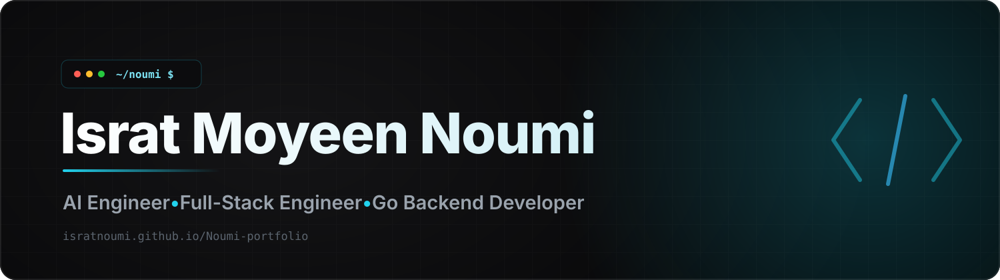

<!-- Banner (links to portfolio) -->

<!-- Typing animation -->

 

<!-- Social badges -->

 

---

I build production AI applications, secure backend services, and distributed systems. My recent work spans agentic AI security workflows, LLM-powered recruitment tools, and concurrent data synchronization services in Go.

## What I'm working on

- Building AI/ML applications at **Dexian Bangladesh**
- Developing agentic workflows with **LangChain, Azure OpenAI, and FastAPI**
- Designing full-stack products with **Next.js, TypeScript, PostgreSQL, and Docker**
- Pursuing an **MSc in Computer Science & Engineering** at Brac University

## Selected work

### Inspectra — AI-powered security assessment platform
*Dexian Bangladesh*

An automated penetration-testing platform that orchestrates **SAST, DAST, and AI/LLM red-teaming** pipelines into a single multi-phase workflow. An agentic AI layer correlates and prioritizes findings across the **OWASP Top 10** and **LLM Top 10**, cutting through noise to surface what actually matters.

- Multi-phase pipeline that fuses static analysis, dynamic scanning, and LLM red-teaming
- Agentic AI system for automated finding correlation, deduplication, and risk prioritization
- Automated DOCX report generation with delivery through Azure Blob Storage
- Fully containerized full-stack deployment with Docker

`FastAPI` · `Next.js` · `Agentic AI` · `LangChain` · `Azure Blob` · `Docker`

### HireNEXT — AI-powered recruitment platform
*Dexian Bangladesh*

A recruitment platform that automates the modern hiring funnel end to end — **job-description generation, CV analysis, candidate shortlisting, and interview preparation** — powered by Azure OpenAI, with security and access control built in from the ground up.

- AI-driven JD generation, CV analysis, and tailored interview-prep workflows
- Hardened auth with JWT + RBAC middleware, row-level security policies, and rate limiting
- Real-time notifications and automated, stage-based recruitment workflows
- Data layer on Supabase / PostgreSQL for scalable candidate management

`Next.js` · `TypeScript` · `Supabase` · `PostgreSQL` · `Azure OpenAI`

> Some professional projects are proprietary, so their source code is not publicly available. More details are available on my [portfolio](https://isratnoumi.github.io/Noumi-portfolio/#projects).

## Technical toolkit

**AI &amp; ML**

  
  
  
  
  
  
  
  

**Backend &amp; data**

  
  
  
  
  
  
  

**Frontend &amp; delivery**

  
  
  
  
  
  
  
  
  

## Research

**Agentic Security: A Systematization of Tools, Failure Modes, and Design Laws for LLM-Driven Penetration Testing**  
IEEE Transactions on Dependable and Secure Computing (TDSC), 2026 — *Under Review*

**PulmoLiteNet: A Lightweight, Parameter-Efficient Architecture for Lung Cancer Histopathology Classification**  
5th IEEE International Conference on Biomedical Engineering, Computer and Information Technology for Health (BECITHCON), 2026 — *Accepted*

**Towards Better Misogyny Detection in Bangla: Improved Dataset and Cutting-Edge Model Evaluation**  
6th International Conference on Sustainable Technologies for Industry 5.0, 2024 — [IEEE Xplore](https://ieeexplore.ieee.org/abstract/document/10951055)

## Certifications

- **Microsoft Azure Fundamentals (AZ-900)** — DataCamp, 2026
- **Certified LLM Security Expert (CLLMSE)** — Red Team Leaders, 2026

## A little more

- Based in **Dhaka, Bangladesh**
- Interested in applied AI, NLP, secure systems, and distributed backend architecture
- Open to opportunities where AI research becomes reliable, useful software

### The best way to reach me is at **[isratmoyeen.23@gmail.com](mailto:isratmoyeen.23@gmail.com)**

